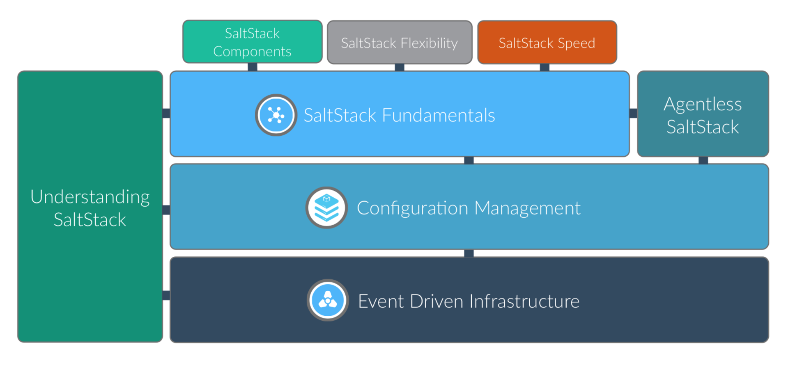

# SaltStack 基础入门

这些入门教程将引导您了解SaltStack的运行基础。

## 什么是SaltStack 

SaltStack是基础设施管理的一种具有革命性意义的方法，以速度替代复杂性。SaltStack足够简单，可以在几分钟内运行，可扩展到足以管理数万台服务器，并且能够在几秒钟内快速与每个系统进行通信。

## 通过阅读本教程你可以获取到如下内容

- 安装和配置 SaltStack 
- 在所有管理的系统上执行命令
- 设计，开发和部署系统配置
- 使用Salt Reactor 自动化您的基础设施
- 使用SaltStack Orchestration协调​​复杂的管理操作

## 本教程包含的话题有

