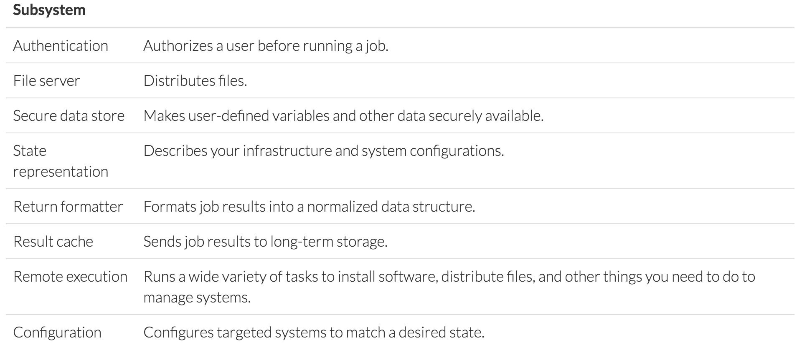
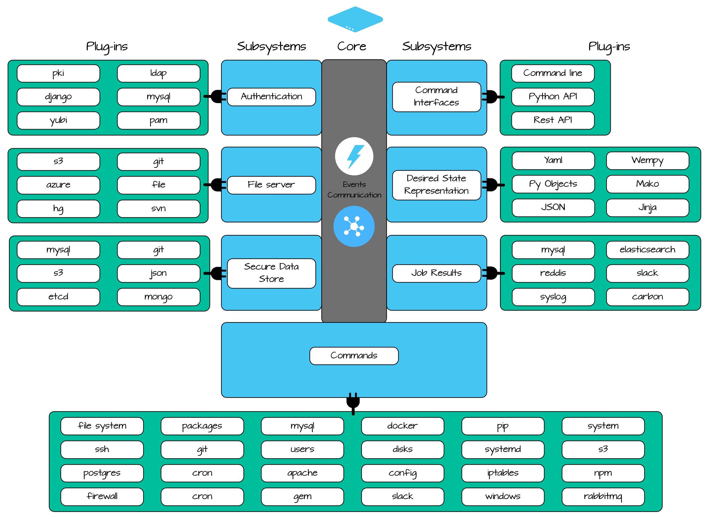
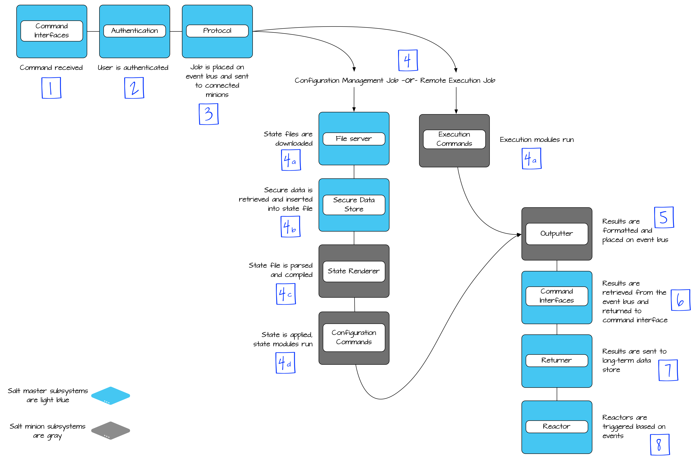
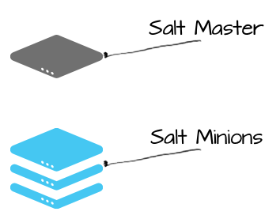
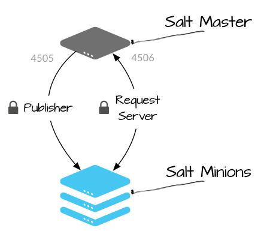
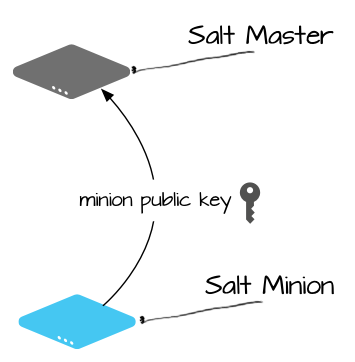
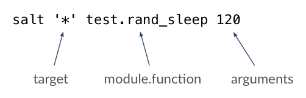

# 理解 SaltStack

## 走近 salt 

你可以通过观察salt的运行来了解salt的工作方式，但是，在控制台上的数据文件可能很难注意到有许多事情发生。“入门”教程的这一部分介绍了Salt的工作原理，Salt子系统以及Salt的模块化架构如何使用，并扩展了Salt来管理整个基础架构。

在了解Salt组件的具体细节之前，让我们先了解一些Salt基础设施管理方式的一些知识。

### 实时通讯

所有的salt minion 同时接受命令。这意味着更新10或10,000个系统所需的时间非常相似，对数千个系统的查询可以在几秒钟内完成。Salt获取基础设施信息的方式是实时查询，而不是依赖（通常是过时的）数据库。

注意：数据库非常适用于存储作业结果，Salt支持超过30个作业结果插件，包括mysql，elasticsearch，syslog，carbon和redis。 Salt为许多数据存储提供了接口和安全配置数据。当涉及到依赖于当前系统配置的决策时，Salt会将一个静态数据库看作是通过发送单独的文本消息，然后在笔记本中写出询问房间中的每个人的问题的答案。

### NO FREELOADERS（不贪图便宜，偷懒）

Salt minion 完成自己的工作。来自Salt master的通信是一组轻量级的指令，基本上说“如果你是具有这些属性的minion：用这些参数运行这个命令。”在接收到命令时，salt minions确定它们是否匹配属性。每个Salt minion都已经具有本地存储的所有命令，因此可以执行该命令，并将结果快速返回给Salt master。Salt master 不会为minion做任何事情（这样通常更好）。

### Salt 评价

Salt专为高性能和可扩展性而设计。Salt的通信系统使用ZeroMQ或原始TCP建立了Salt master和minion之间的持续数据管道，使得Salt相对于竞争解决方案具有显着的性能优势。消息可以使用MessagePack在线上有效序列化。在内部，Salt使用Python Tornado（由一些真正的智能开发人员实现）作为异步网络库，Salt通过使用前沿方法进行多线程和并发调整。

在一个单一的生产主机上满足超过10,000个用户的用户并不罕见，在单个salt master中有已知的部署超过3.5万次！(译者注：估计和服务器环境有关，实测16核16G内存的机器，单台master承载的minion数最多在1k左右，并没有3.5w这么多。) Salt已经证明了现实世界的速度和可扩展性。

### 标准化一切

规范化是Salt跨平台管理能力的关键。无论您是针对的是Linux，Windows，MacOS，FreeBSD，Solaris或AIX，都位于物理硬件或云端，或者您正在定位一个容器，则salt命令和state都是一样的。Salt提取每个操作系统，硬件类型和系统工具的详细信息，以便您可以正确地管理基础架构。

所有内容还包括返回：Salt命令返回结果，保持一致的数据结构，便于消费和存储。

### 管理一切

Salt几乎可以运行在可运行Python的所有系统。对于不能很好地运行Python的设备，您可以使用代理服务器系统。这意味着由Salt管理的唯一要求是支持任何网络协议（即使您自己编写协议）。Salt命令被发送到代理服务器，它将salt调用转换为本地协议，然后将它们发送到设备。解析来自设备的返回数据，然后放入数据结构并返回。

### 自动化一切

Salt的事件驱动式基础设施不仅可以让您自动执行初始系统配置，还可让您随时随地自动化进行扩展，修复和执行持续管理。Salt用户可自动部署和维护复杂的分布式网络应用程序和数据库，自定义应用程序，文件，用户帐户，标准软件包，云资源等等。

### 无需编程

您可以使用所有的salt功能，而无需学习编程语言。Salt的远程执行功能是CLI命令，State系统使用YAML来描述系统的所需配置。

您仍然可以采用“基础架构代码”的方法 - Salt具有许多支持这些功能的工具，包括强制性和声明式执行的强大的必需系统。Salt只是让您无需编写Python或Ruby代码来描述您的基础设施。

### 通过模块化系统实现可扩展性

一些管理工具认为自己是可扩展的，因为它们可以运行外部脚本。在salt中，一切都是可扩展的。正如您将在下一节中学到的，即使是底层通信协议也是可互换的。 Salt有超过20个可扩展子系统，这意味着如果Salt可以做到这一点，那么您可以自定义如何完成。

Salt可以快速采用新技术并管理新的应用程序，因为它们是可以被二次开发的。您将永远不会受制于别人的决定，哪个才是管理您的基础设施的最佳方法。

## 插件式

关于Salt的任何讨论都将是不完整的，都没有讨论插件。

基本的解释是：Salt的核心框架提供了一个高速的通讯和事件总线。此框架连接并验证受管系统，并为这些系统提供发送通知的途径。

在这个核心框架之上，Salt的其余功能被暴露为一组松散耦合的可插拔子系统。

### 可插拔的子系统

Salt包含超过20个可插拔子系统，但大多数用户只对少数用于直接管理的系统感兴趣。下表包含Salt中一些更常见的子系统的列表：



为了说明，下图显示了几个常见子系统以及每个子系统最常用的插件。



该图只显示了少数可用的子系统和插件，但它应该让您了解Salt的一般架构。

### 工作运行期间的子系统

当一个作业运行时，调用了几个Salt子系统来处理作业。下图显示了典型状态运行或远程执行作业的子系统流程：



在每个步骤中，子系统将其工作委托给配置的插件。例如，步骤7中的作业恢复程序插件可能是包括MySQL、redis在内的30个插件中的一个，或者根本不配置（作业恢复程序插件也可以在步骤4之后直接在受管系统上运行）。

在每个步骤中，有许多插件可用于执行任务，从而产生了数百种可能的Salt配置和工作流程。

### 灵活性

这种灵活性使salt成为一个非常强大和可定制的工具，但是当您了解该工具时，它也使得很难回答标准问题。

为了乐趣，让我们采取“技术上准确”的方法，并回答关于salt的一些常见问题：

- 你如何开始使用salt工作？ - 从可以调用Python，REST API，命令行或使用Salt的内置调度程序的任何接口。
- salt 如何格式化结果？ - YAML，JSON，纯文本，python数据结构和其他几种格式，您可以随时使用单个参数更改格式。
- Salt用于配置声明的格式如何？- 从15种支持格式中选择一种，具体取决于用例，您还可以选择模板语言。格式是以每个文件为基础指定的，因此您可以同时使用多种格式。
- 存储结果在哪里？任何你想要的，你有30个选择！

在交谈中这样的回答是非常令人讨厌的,这样回答问题并没有说salt的具体管理方法。你的基础设施,在当今复杂的环境没有一个最好的方式去做管理。

不过,不要担心，salt是开箱即用的,大多数salt用户使用默认配置即可。有灵活性的体现是,当如果你需要它的时候。
### salt 的组成

随着您对Salt中可插拔子系统的新认识，希望您开始了解每个Salt组件实际上是Salt中的可插拔子系统，并具有相应的插件。Salt grains? Salt pillar? Salt runners? 所有可拔插的子系统都是很容易扩展的。

### 虚拟模块

我们讨论了很多,但是有一个关于模块额外的东西我们需要解决。 记得早些时候我们解释的salt抽象底层操作系统的细节吗? salt达到这种抽象的方法之一是通过使用虚拟模块。

一些管理在操作系统之间的运行时不同的，所以在编写模块的时候很少能够重用。

例如，Debian系统上的软件包管理使用一个名为aptpkg的执行模块完成。在Redhat上，使用一个名为yumpkg的执行模块（由于应该是明显的原因）完成。如果你一直使用Salt，你会知道salt调用pkg远程执行模块进行包管理，它可以在所有的操作系​​统上运行。

要启用此类型的抽象，Salt使用虚拟模块名称加载这些类型的模块。aptpkg模块包含基本上说“如果您是Debian系统，将此模块加载为pkg的说明。否则，请勿加载！“相似的代码存在于yumpkg中，并检查Redhat或CentOS。这样可以存在多个模块来执行相同的任务，但只有一个模块加载了虚拟名称。

当您阅读模块文档时，请记住这一点，因为您经常需要阅读非虚拟模块的文档来了解行为。您可以在Salt模块中搜索__virtualname__，以查找Salt在加载该模块时使用的名称。


## 通信与安全

本节介绍了Salt通信模型以及身份验证和安全性的基本概述。

### 构建模型

Salt使用服务器代理通信模型（尽管它可以作为独立的单服务器管理实用程序运行，并且还提供通过SSH运行无代理的能力）。服务器组件称为Salt master，代理称为Salt minion。



Salt master 负责向 Salt minion发送命令，然后汇总并显示这些命令的结果。单个Salt master可以管理数千个系统。

### 通讯模式

Salt使用发布 - 订阅模式与被管理系统进行通信。连接由Salt minion启动，这意味着您不需要打开这些系统上的任何进入端口（从而减少攻击向量）。Salt master使用端口4505和4506，必须打开以接受传入连接。




| 名称 | 说明 |
| ---- | ----|
| publish | （端口4505）所有Salt minions建立与发送端口的持久连接，用于监听消息。命令通过该端口异步发送到所有连接，这使命令能够同时在大量系统上执行。 |
| Request Server | （端口4506）Salt minions 根据需要连接到请求服务器，以将结果发送给Salt master，并安全地请求文件和特定于数据的数据值（称为“Salt Pillar”）。连接到这个端口在 salt master 和 salt minion之间是1：1（不是异步的）。 |

### salt minion 的认证

当第一次启动minion时，它会在网络上搜索一个名为salt的系统（虽然可以轻松更改为IP或不同的主机名）。当发现时，minion发起握手，然后将其公钥发送给salt minion。



在初始连接之后，Salt minion的公钥存储在服务器上，并且必须使用salt-key命令（或通过一些自动机制）在Salt主机上接受。这可能是新用户的容易混淆的地方，因为Salt将不会提供解码消息所需的安全密钥，直到Salt minion的公钥被接受（这意味着Salt minion在其密钥被接受之前不会运行任何命令） 。

在密钥被接受之后，Salt master返回其公钥以及用于加密和解密由Salt master发送的消息的旋转AES密钥。返回的AES密钥使用Salt minion最初发送的公开密钥进行加密，因此可以仅由Salt minion进行解密。

### 安全通讯

Salt master和Salt minion之间的所有进一步沟通都使用AES密钥进行加密。AES加密密钥根据最新接受的TLS版本使用显式初始化向量和CBC块链接算法。

### 轮转安全密钥

轮转的AES密钥用于加密Salt主机发送给Salt minion的作业，并加密与Salt主文件服务器的连接。每当Salt master重新启动并且每次使用salt-key命令删除Salt minion密钥时，都会生成并使用一个新密钥。

密钥轮转后，所有Salt minions必须重新验证以接收更新的密钥。这使AES键可以轮转而不中断连接。

### 加密通信通道

master 和 minion 之间的公开通信使用旋转的AES密钥进行加密。master 和 minion 之间的直接通信使用每个会话的唯一AES密钥进行加密。例如，已发布的作业使用旋转的AES密钥进行加密，而使用Salt Pillar 发送的安全的特定于数据库的数据将使用每个salt minion和会话的唯一AES密钥进行加密。

### 用户访问控制

在发送命令之前，Salt会对Publisher ACL执行一些内部检查，以确保执行命令的用户具有正确的权限。如果用户被授权针对指定的目标运行指定的命令，则发送命令。否则返回错误。Salt还返回预期对命令行界面做出响应的小数目录，因此它知道等待返回的时间。


## 远程执行 

本教程将介绍远程执行系统的工作原理。有关使用远程执行的教程，请参阅[执行命令](https://docs.saltstack.com/en/getstarted/fundamentals/remotex.html)。

Salt从一开始就被设计为一个远程执行工具，远程执行被Salt的其他子系统大量使用。

- Salt命令设计用于跨操作系统和跨平台的工作。`salt '*' pkg.install git` 命令使用基于目标平台的封面下的yum，apt，pacman或Salt的Windows包存储库。一个命令，很多系统。
- 所有Salt命令都会返回一致的数据结构。这使得检查结果或将它们存储在数据库中变得容易。
- 所有目标系统可以同时运行作业，因为它们都同时接收到命令。
- Salt使用数百个Python模块的库执行远程管理，您可以轻松添加自己的（或更好的，并将其贡献给项目！）。任何可以使用Python，shell命令或几乎任何其他接口访问的应用程序或服务都可以作为Salt中的执行模块公开。

### 远程执行

使用salt命令行界面访问远程执行系统。让我们从Salt界面发出一个简单的命令，并通过Salt系统进行跟踪：
```
salt '*' test.rand_sleep 120
```
基于我们对salt通信系统的了解，这里发生了什么：

- 1. 该命令通过发布者端口发送到所有连接的小minion。
- 2. 每个minion将检查命令，根据目标进行评估，并决定是否运行命令。
- 3. 目标系统运行该命令，然后将结果返回到请求服务器。

让我们深入探讨，当命令运行时，会发生什么事情。首先，每个命令都被拆分成一个单独的工作线程，所以Salt minion可以一次处理多个作业。但是，salt minion 将如何将test.rand_sleep 120命令变为行动？

用于管理系统的所有命令都由Salt执行模块提供。这些模块是Salt的实际工作，一旦你知道有关它们如何工作的一些事情，就很容易使用。当Salt minion收到一个命令时，它只需找到正确的模块（在本示例中为测试模块），然后调用相应的函数（rand_sleep），提供所提供的参数（120）。在这个意义上，你可以将Salt看作是一个（疯狂的强大）抽象层到Python的功能。



当使用远程执行时，您需要将[完整的执行模块列表](https://docs.saltstack.com/en/latest/ref/modules/all/index.html)加入书签。如果您想知道Salt是否可以管理Tomcat服务器，这是您的第一站（注意：是的，它可以）。模块文档有很多例子，调用简单。

模块和函数在Python部分再次讨论，所以我们现在继续讨论配置管理子系统Salt状态。

## State 系统

本教程将介绍状态系统的工作原理。有关教程，请参阅[配置管理](https://docs.saltstack.com/en/getstarted/config/)。

Salt state 系统在远程执行后出现的，正如您所期望的那样，它很大程度上利用了远程执行系统。salt state模块与Salt远程执行模块非常相似，有一个重要的区别。State 模块包含逻辑，以查看系统是否已经处于正确的状态。事实上，在做出这样的决定之后，State模块通常只需要调用远程执行模块来完成工作。

- 状态模块命令设计用于跨操作系统和跨平台的工作。
- 所有State模块命令都会将结果返回到一致的数据结构中。这使得检查结果或将它们存储在数据库中变得容易。
- 所有目标系统可以同时运行作业，因为它们都同时接收到命令。
- Salt使用数百个Python模块的库执行配置管理，您可以轻松添加自己的（或更好的，并将其贡献给项目！）。任何可以使用Python，shell命令或几乎任何其他接口访问的应用程序或服务都可以使用Salt中的状态模块进行配置。

### State 系统流程

State 系统和远程执行系统之间的主要区别是State系统中的流量控制。Salt提供了特殊命令，可以让您定义依赖关系，重用代码，分支失败，控制流程以及利用变量和模板。

这是使用实际的例子最好的说明，我们将留给[配置管理指南](https://docs.saltstack.com/en/getstarted/config/)。

## Runner 

Runner 子系统提供在Salt主机上执行的Salt模块（请记住，远程执行和state模块在每个目标配件上同时独立运行，而不是在Salt主机上运行）。

Runner 可以列出工作状态，实时查看事件，管理Salt的文件服务器，查看salt minion数据，发送唤醒服务到minions，调用webhooks和其他http请求等等。

- 使用salt-run命令行界面调用运行符。它们不会执行目标，因为目标是执行命令的Salt master。
- 将参数传递给Salt runners的语法与用于将参数传递给Salt执行模块的语法相同。

### 编排 Runner 

由于它提供了Salt的核心功能之一，Runner 自己的部分：以定义的顺序运行命令并跨多个分区应用配置的能力。例如，使用业务流程管理器，您可以使用State系统的全部功能来配置多个系统（包括必需条件，分支失败，依赖关系，有序执行等）。当您准备好探索此功能时，这将在“ [Orchestration with Salt](https://docs.saltstack.com/en/latest/topics/orchestrate/orchestrate_runner.html#orchestrate-runner)”中深入介绍。


## 基础数据

### 数据

本节讨论系统数据的两个主要方面：获取有关系统的数据，以及获取数据到系统。Salt提供两个不同的子系统来分别执行这些任务：Salt grains 和 Salt pillar。

本节还介绍了一个名为Salt mine的第三个组件，它用于将数据从minion位置推送到master上的共享数据存储器，可以由所有子系统访问。

### Grains 

Grains用于获取有关您的系统的数据。Grains是关于底层操作系统，内存，磁盘和许多其他系统属性的静态信息。

minion 开始并定期刷新或使用远程执行命令时会自动收集grains。

那么你能用grains做什么呢？您可以使用grains执行模块收集库存，这可以让您列出所有的grains，查找具有特定粒度值的系统等等。

Grains 也是targeting系统的组成部分。grains被用来瞄准salt states和salt pillar数据，这些数据直接导致了下一个数据子系统：Salt pillar。

### Salt Pillar 

Pillar用于将数据传送到系统。考虑配置即使是简单系统时所需的不同自定义数据：用户名，服务URL，首选安装路径，端口，非默认应用程序设置等等。通常，这些值对于每个系统或系统角色（Web，数据库等）而言是不同的。

允许您定义这些数据值，然后使用targets将其分配给一个或多个分区。然后可以使用变量将值插入salt state。

Pillar数据使用目标minion的公钥加密，并通过安全通道发送，因此Pillar也非常适合分发安全数据，如密码和ssh密钥，因为它只能由目标 minion 解密。Pillar数据永远不会写入到minion的磁盘上。

默认的Salt Pillar模块使用YAML文件定义，有30多个Salt pillar模块（也称为插件）可用于支持各种各样的后端。热门选项包括Mongo和Redis，它们均设计用于存储结构化数据。许多用户坚持使用YAML文件，但使用私有git repo来管理和分发 pillar 数据。

### SALT MINE

Salt mine 用于在salt minions 中分享数据值。例如，如果您设置了共享数据库，则可以配置在数据库服务器上运行的Salt minion，将其IP地址自动推送到Salt mine。这是比将其存储在Salt state或 Salt Pillar中更好的方法，需要手动更新。

稍后当您设置需要此值的系统时，可以直接从Salt state文件访问Salt mine。

Salt mine 很容易使用，许多用户最大的问题是记得使用它！

其他的基本子系统将在其他“入门指南”中介绍，因此我们将通过覆盖几个Python基础知识来进行整理，这将帮助您更有效地使用Salt。

## python 

我知道我们以前说过你不需要编写Python或其他代码来使用Salt，这是真的。然而，在许多情况下，可以读取Python或至少Python函数文档是有用的，其结果是编写Python容易得多。

本部分将介绍可帮助您更好地了解Salt如何工作的Python基础知识。

### Module 

在Salt中，每个子系统插件都是一个Python模块。在Salt方面，您可以将模块视为管理应用程序（mysql，docker），系统组件（磁盘，文件）或与外部系统（gitfs）进行交互的一组函数（aka命令）。

这是你需要知道的：

- 所有的模块都在源文件夹的salt文件夹中。每个子系统都有一个单独的文件夹，每个模块是以.py结尾的单独文件。
- 模块的命名空间为salt.subsystem.module。该命名空间在文档中可见，因此您可以快速了解您正在查看的子系统模块类型。一点混乱：执行模块从salt.module开始，因为它们是Salt的初始版本中可用的第一个也是唯一的模块（当时间旅行发明时，我们应该用salt.execution来开始这些）。
- 模块包含所需的或多或少的功能。文件执行模块（salt.modules.file）有很多功能，因为文件管理是一件很大的事情。uwsgi统计服务器执行模块（salt.modules.uwsgi）只有一个。

### FUNCTIONS

如果您了解上一节的模块，功能更容易。您可以将功能视为模块中的特定命令，您可以调用它们来管理和配置系统。例如，salt.modules.pkg.install，salt.modules.network.interfaces和salt.modules.user.add都是常见的执行功能。函数是Salt的动词，您通常可以通过打开模块文档并查看函数名称来找出要调用哪个函数。

### ARGUMENTS

参数有点复杂，特别是如果您不熟悉关键字参数，并且参数语法是您开始使用Salt时通常会绊倒的地方。参数在远程执行和状态之间的表达方式不同，因此我们将分别介绍。

#### 执行功能参数

当在命令行上调用Salt时，执行参数作为附加值传递，或者作为一个值，或者作为argument=value。通常按照特定的顺序传递必需的值，因为值仅由空格分隔，并且具有默认值的可选参数作为argument=value。

例如，看看在Salt文档中显示的user.add的功能签名（用户是一个虚拟模块，因此我们正在查看useradd的文档）：
```python
salt.modules.useradd.add(name, uid=None, gid=None, groups=None, home=None,
shell=None, unique=True, system=False, fullname='', roomnumber='',
workphone='', homephone='', createhome=True, loginclass=None)
```

调用此模块时，需要名称，您可以看到没有提供默认值。剩余的参数将使用列出的值，除非您传递不同的值作为覆盖。以下示例创建一个名为Fred的用户并设置不同的默认shell：
```bash
salt '*' user.add fred shell=/bin/zsh
```

#### 更多例子

常规参数和关键字参数（通常缩写为args和kwargs）是您遇到的最常见的类型。这是一个传递一个arg和三个kwargs的例子：
```bash 
salt '*' network.connect google-public-dns-a.google.com port=53 proto=udp timeout=3
```

通过两个args和一个kwarg：
```
salt '*' cp.get_file salt://vimrc /etc/vimrc gzip=5
```

一些执行模块接受列表，其传递如下：
```
`salt ns1 pkg.install pkgs=['bind9','bind9-docs','bind-utils']`
```

有些甚至列出了一些字典：
```
salt '*' pkg.install sources='[{"foo": "salt://foo.deb"},{"bar": "salt://bar.deb"}]'`
```
Salt文档包含很多示例，如果您遇到困难，[IRC](http://webchat.freenode.net/?channels=salt&uio=mj10cnvljjk9dhj1zsyxmd10cnvl83)中通常有友好的Salt用户可以帮助您。

#### 状态函数参数

使用YAML语法在状态文件中调用状态函数。YAML语法非常适用于表示数据类型，因此您可能会发现状态中更容易使用复杂数据类型的调用函数。要了解用户在某种状态下的添加方式，请查看salt.states.user.present函数：
```python
salt.states.user.present(name, uid=None, gid=None, gid_from_name=False,
groups=None, optional_groups=None, remove_groups=True, home=None,
createhome=True, password=None, hash_password=False, enforce_password=True,
empty_password=False, shell=None, unique=True, system=False, fullname=None,
roomnumber=None, workphone=None, homephone=None, loginclass=None, date=None,
mindays=None, maxdays=None, inactdays=None, warndays=None, expire=None,
win_homedrive=None, win_profile=None, win_logonscript=None,
win_description=None)
```

即使有很多参数，使用YAML中的关键字参数调用函数很容易：
```yaml
a state example that calls user.present:
  user.present:
    - name: fred
    - shell: /bin/zsh
```
列表也易于使用YAML进行定义：
```yaml
install bind packages:
  pkg.installed:
    - pkgs:
      - bind9
      - bind9-docs
      - bind-utils
```
定义字典列表也比在命令行上更容易：
```yaml
Install some packages using other sources:
  pkg.installed:
    - name: mypkgs
    - sources:
      - foo: salt://foo.deb
      - bar: http://somesite.org/bar.deb
```

一个应用于执行和状态函数的提示：不是所有可用的参数都列在函数签名中。几个执行函数作为其他Python API或接口的封装，因此它们只会传递您提供的任何参数。这些额外的参数通常记录在签名下方，但有时您必须检查代码或相应的界面才能知道支持的内容。这应该让您充分了解执行和状态子系统如何使用Python来开始使用。继续SaltStack基础知识，了解如何安装并开始使用Salt。