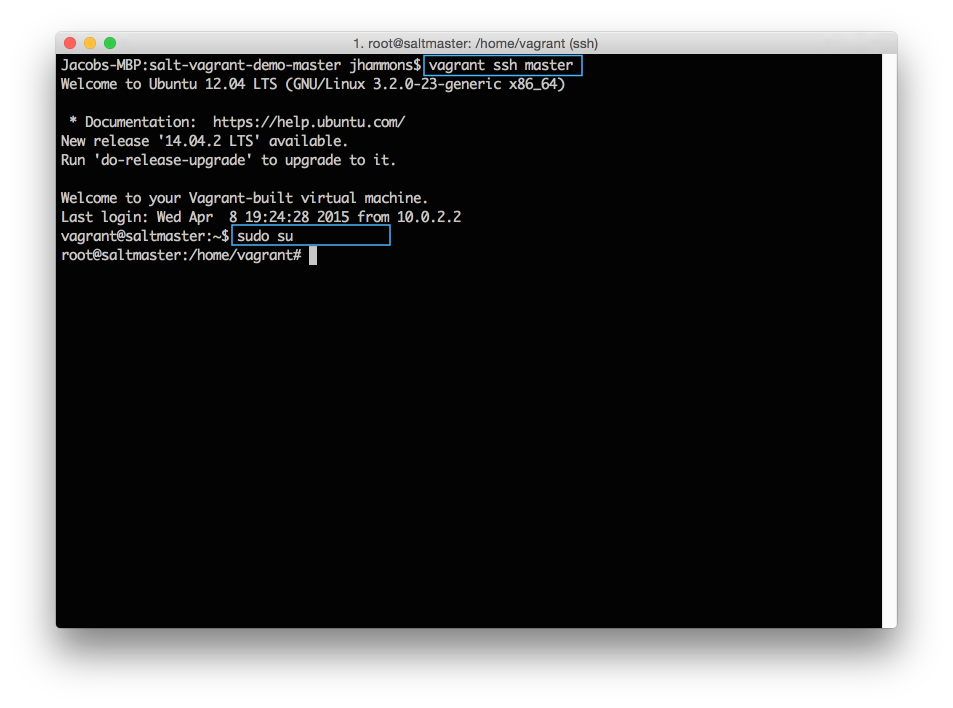
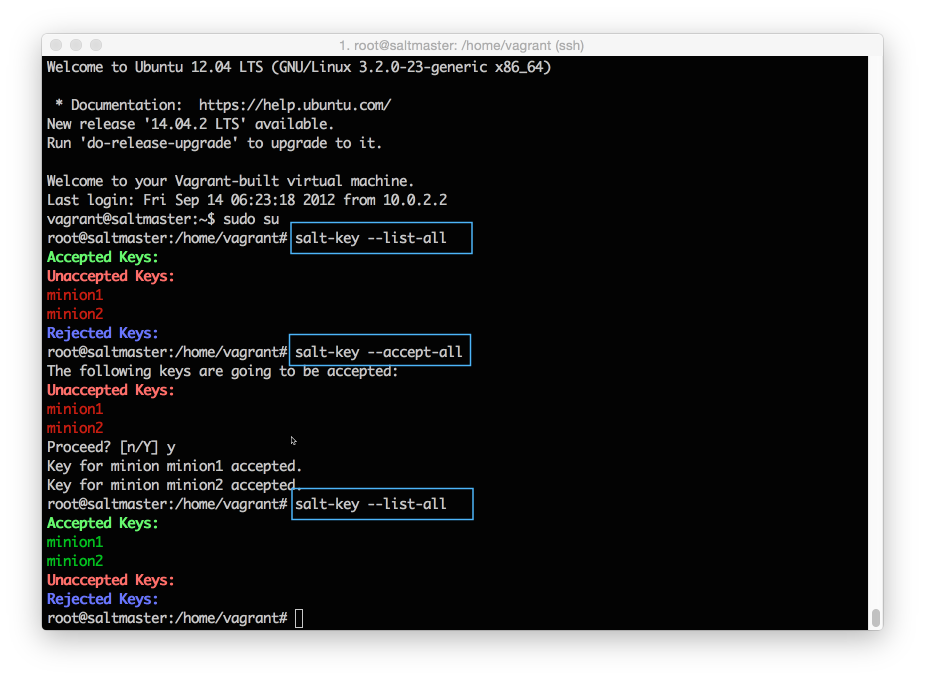
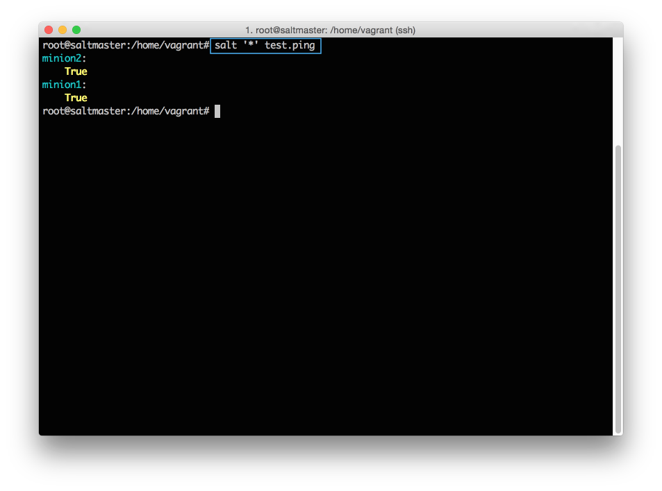
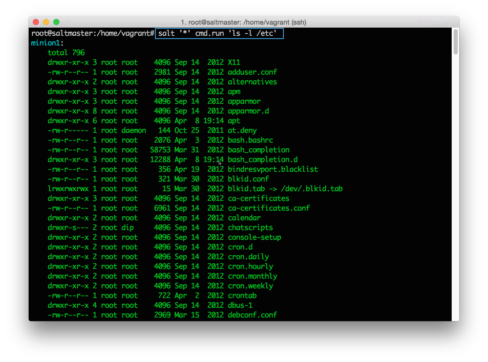
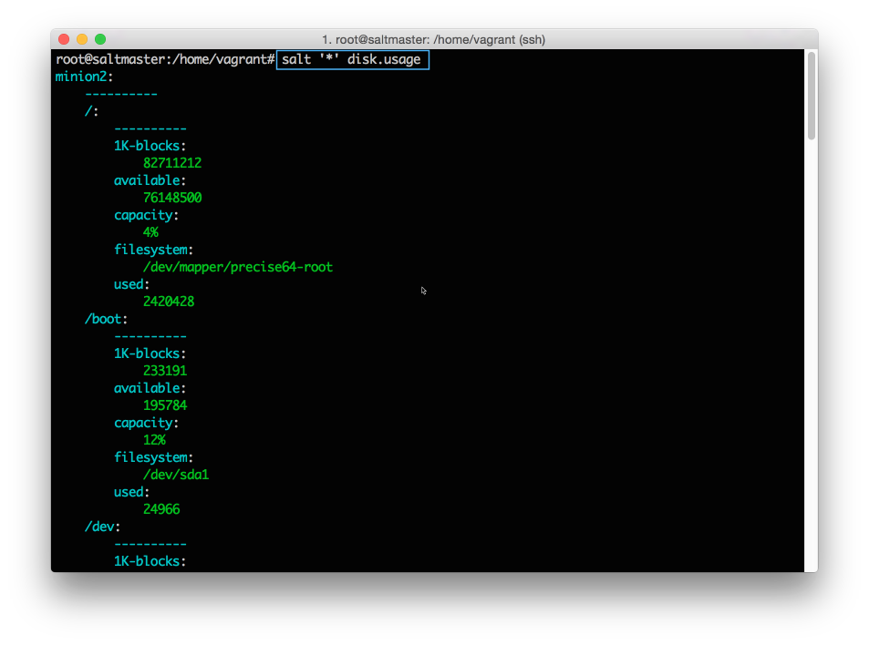
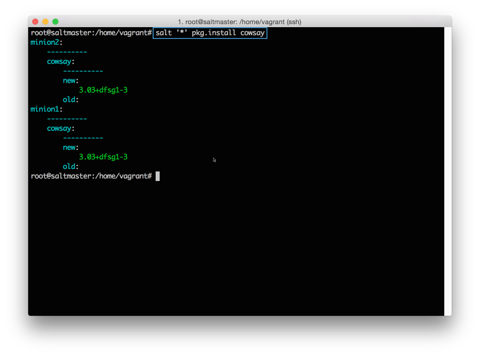
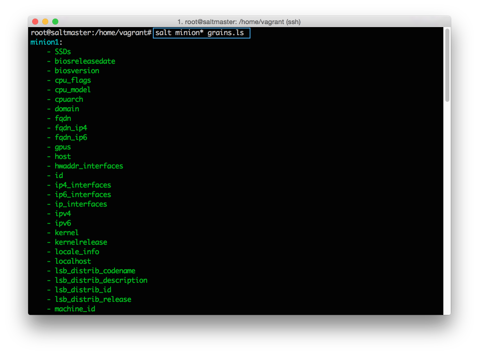
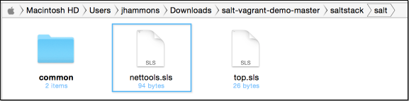
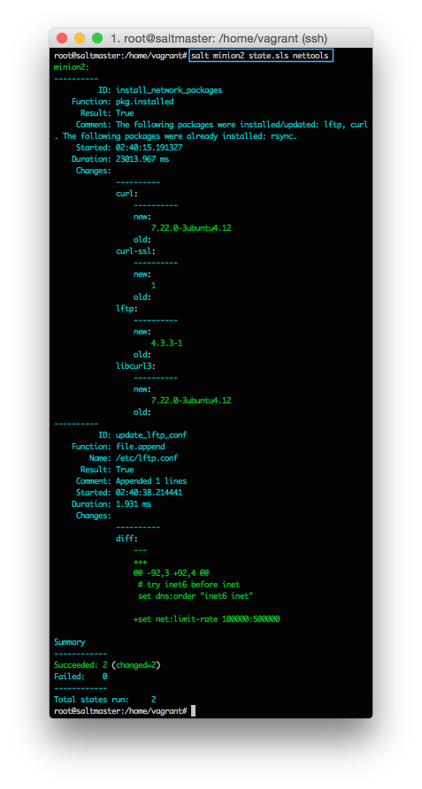
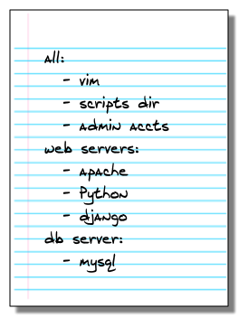

# SaltStack 的基础

本入门指南将引导您了解开始使用SaltStack时需要学习的基本概念。

我们将解释如何：
- 安装SaltStack 
- 在受管系统上运行命令 
- 定义可重复使用的配置 
- 将命令和配置应用于特定系统

学习SaltStack是一个实践经验。通过阅读本指南，您可以轻松获得这些内容，SaltStack易于设置，我们已经包含了几个可以运行的示例来帮助您学习。此外，您可以在完成后继续保持演示环境，继续尝试。

## 实例测试环境

完成这些说明以建立一个简单的SaltStack环境。

1. 安装[VirtuanBox](https://www.virtualbox.org/)。
2. 安装[Vagrant](https://www.vagrantup.com/)。
3. 下载[https://github.com/UtahDave/salt-vagrant-demo](https://github.com/UtahDave/salt-vagrant-demo)。
您可以直接从GitHub使用git或下载项目的zip：


4. 提取您下载的zip文件，然后打开一个命令提示符到提取的目录:
```bash
    # windows 
    cd %homepath%\Downloads\salt-vagrant-demo-master
    # mac 
    cd ~\Downloads\salt-vagrant-demo-master
```

5. 运行`vagrant`，启动演示环境:

```
vagrant up 
```
在`vagrant up `（〜10分钟）之后，您将返回命令提示符，您随时可以继续执行本指南。

## 安装SaltStack

原文：[https://docs.saltstack.com/en/getstarted/fundamentals/install.html](https://docs.saltstack.com/en/getstarted/fundamentals/install.html)

要安装SaltStack，您将需要一个详细的网络图，其中包含完整的DNS映射，企业数据库服务器，除此之外，您不需要任何东西。所有您需要的是一种在系统上安装软件包的方法，大约10分钟。

您可以从包管理器，pip，直接源码或使用引导脚本安装SaltStack。SaltStack还提供专用工具来创建机器，并在公共和私有云（salt-cloud and salt-virt）上安装。我们不会在这里介绍这些工具，但只要知道，一旦您有一个正在管理的系统，SaltStack在物理，云和虚拟资源之间使用是相同的。

### 安装

如果您使用上一节中链接的Vagrant项目，则已经安装了SaltStack，并且已经接受了每个服务的连接。您可以在下面的接受连接中完成任务，以验证您的`minion`是否已连接。

如果您使用的是不同的环境，则安装SaltStack最简单的方法是使用引导脚本。此脚本在大多数操作系统上安装SaltStack与几个常用salt命令。具体安装步骤,
- [视频](https://docs.saltstack.com/en/getstarted/fundamentals/install.html)
- [文档](https://docs.saltstack.com/en/latest/topics/installation/index.html#quick-install)

### 接受链接

Salt Master和Salt minion之间的每个连接都使用加密密钥进行管理和保护。安装完成后，每个Salt minion将其公钥发送给Salt master，并迫切地等待接受。在系统可以从Salt master接收到命令之前，必须接受Salt minion 的公钥。

在命令提示符下，进入vagrant-demo-master目录，并运行以下命令登录到您的Salt master:
```
vagrant ssh master 
```

连接后，运行以下命令切换到root用户：
```
sudo su
```



#### 查看所有的键

在Salt master上，您可以快速查看所有Salt minion连接，并查看连接是否被接受，拒绝或挂起。

```
salt-key --list-all
```

#### 接受一个特定的钥匙

在Salt minion可连接之前，您必须接受其钥匙。

```
salt-key --accept=<key>
```

#### 接受所有KEYS



### 执行一条命令

在您接受每个密钥后，从Salt master发送一个命令，以验证您的Salt Minions是否正在侦听：
```
salt '*' test.ping
```



如果您没有看到所有的Salt minion回应，那么您需要手动排查到底发生了什么。你可能键入了一个错误的或不接受的一些keys，或者忘记在某个地方添加一个空格（#soml）。在你的Salt minion全部回应之后，继续下一节，让SaltStack工作。

## 命令执行

安装SaltStack之后，您便可以运行shell命令，更新软件包和分发文件到所有受管系统。作为一个奖励，所有的响应都是以一致的，可配置的格式返回的，所以你可以很容易地看到什么是没有工作。

### 命令语法

Salt 命令使用通用结构执行：


**target：** 确定哪个系统应用命令。默认情况下使用主机名称globbing，但还有其他许多方法可以选择和过滤，以后我们会进一步讲解。现在，已经足够知道*针对所有受管系统。
**command (module.function)：** 这就是您如何利用Salt的实力。命令由模块和功能组成，Salt配有内置模块，用于安装软件，复制文件，检查服务以及要自动化的大多数其他任务。
**arguments：** 提供您正在调用的功能所需的任何额外数据。例如，pkg.install函数需要知道要安装的软件包。你可以用一个参数来告诉它。

### 查看命令文档

您可以将模块或函数名称传递给sys.doc执行模块，以从命令行直接获取任何模块的详细信息。此列表将根据目标进行过滤。

```
salt '*' sys.doc
salt '*' sys.doc pkg
salt '*' sys.doc pkg.install
```

### 运行 shell 命令

Salt允许您使用`cmd.run`跨多个系统执行shell命令：
```
salt '*' cmd.run 'ls -l /etc'
```

所有受管系统同时并立即执行此命令，然后将输出返回给Salt主机。



### 运行功能函数 

虽然可以使用cmd.run来执行shell命令，但当您添加Salt执行功能时，才体现出其功能的强大。Saltstack 社区为创造数百个简化大多数管理任务的函数付出了巨大的努力。更好的是，所有支持的平台可以一致地使用相同的函数。抵制住使用shell的冲动，学习使用salt function吧。

### 显示磁盘的使用情况

```
salt '*' disk.usage 
```




### 安装软件包

```
salt '*' pkg.install cowsay
```



### 列出网络接口

```
salt '*' network.interfaces
```


这些只是可用的许多执行功能的几个例子。

## TARGETING

Target 是在运行命令，应用配置以及在SaltStack中进行几乎任何涉及Salt minion的任何其他操作时，用来选择Salt minions的。

Target 最简单的方法是使用Salt minion ID。该值可以设置为在minion配置文件中所需的任何内容，并且可以使用引导脚本中的-i选项指定。

```
salt 'minion1' disk.usage
```

### GLOBBING

通过简单地在目标中包含通配符来支持Salt minion的GLOBBING：
```
salt 'minion*' disk.usage
```

### 其他方式

在理想的世界中，您环境中的每个系统都有一个结构化的名称，可以告诉您需要了解有关硬件，操作系统和系统角色的一切。在等待这个世界的同时，SaltStack提供了强大的定位系统，帮助您根据静态和自定义数据查找和过滤系统。

Target 可以基于使用grains系统的Salt minion系统信息：
```
salt -G 'os:Ubuntu' test.ping
```

可以通过正则表达式过滤目标:
```
salt -E 'minion[0-9]' test.ping
```

可以在列表中明确指定：
```
salt -L 'minion1,minion2' test.ping
```

或者可以在一个命令中组合多个目标类型：
```
salt -C 'G@os:Ubuntu and minion* or S@192.168.50.*' test.ping
```

不要太担心这些定位方法了。只要确定目标机制就足够灵活，找到要管理的系统。

### Grains 

Grains 是静态信息,SaltStack收集关于底层管理系统的信息。 SaltStack为操作系统，域名，IP地址，内核，操作系统类型，内存和许多其他系统属性收集grains。

您可以将其自己的grains添加到Salt minion，将它们放在Salt master上的`/etc/salt/grains`文件中，或者在grain部分的Salt minion配置文件中。例如，许多用户向每个Salt minion添加称为Role的自定义grains来描述系统的功能。

您可以使用grains.ls命令列出Salt minion上的所有grains：



## 创建 salt state

远程执行能够很大程度上节省时间，但它有一些缺点。您执行的大多数任务是许多命令，测试和操作的组合，每个都有自己的细微差别和故障点。通常尝试将所有这些步骤组合到一个中央shell脚本中，但是这些脚本很快就会变得难以置信，并引入他们变得头痛。

为了解决这个问题，SaltStack配置管理允许您创建一个称为 state 的可重用配置模板，该模板描述将系统组件或应用程序置入已知配置所需的所有内容。

他们在运行中时，我们更容易理解，所以让我们编写一个试试。state 使用YAML进行描述，并且易于创建和读取。

为了简化事情，我们的Vagrant文​​件将Salt主机上的`/srv/salt`目录映射到本地的`salt-vagrant-demo-master/saltstack/salt`目录。这意味着您可以使用本地文本编辑器并将文件保存到本地文件系统，Vagrant使它看起来像Salt主机上一样。

使用任何纯文本编辑器，创建一个新的文本文件并添加以下内容：
```yaml
install_network_packages:
  pkg.installed:
    - pkgs:
      - rsync
      - lftp
      - curl
```

这个 State 调用`pkg.installed` state 函数，并传递pkgs参数的三个包名称列表。将此示例另存为`salt-vagrant-demo-master/saltstack/salt/nettools.sls`：



让我们来检验我们的 state 。我们将在下一节中了解一种更强大的应用state（称为highstate）的方法，但现在您可以使用state.apply命令直接从命令行应用state。

```
salt 'minion2' state.apply nettools
#state.apply was added in 2015.5, so if you are using an earlier version call state.sls instead.
```
您可能已经猜到，您可以使用定位机制将此状态应用于任何一组Salt minions。现在只要选一个或全部你的Salt minion。如果一切顺利，你会得到类似的输出：



如果这还不够酷，请将state再次应用到相同的Salt minion：，并查看输出：


### 相关术语 

**Formula：** 配置应用程序或系统组件的Salt state和Salt pillar文件的集合。大多数Formula由分布在多个Salt state文件中的几个Salt states组成。

**State:** 配置系统特定部分的可重用声明。每个Salt state 都使用 state declaration 来定义。

**State Declaration:** 列出构成state的 state functions 调用和参数的 state 文件的顶级部分。每个state declaration 都以唯一的ID开始。

**State Functions:** 您调用以在系统上执行配置任务的命令。

**State File:** 包含一个或多个state declaration 的SLS扩展名的文件。

**Pillar File:** 具有SLS扩展名的文件，用于定义系统的自定义变量和数据。

#### YAML 

Salt使用一种称为YAML的简单语言来描述配置。这是你需要知道的：
- YAML使用固定的缩进方案来表示数据层之间的关系。 Salt要求每个级别的缩进由两个空格组成。不要使用tab。
- 破折号表示列表中的项目。
- 键值对由`key：value`表示

#### 执行顺序

状态文件中的命令从上到下执行。在此示例中，在更新配置文件之前安装软件包，因为该部分首先出现在文件中。SaltStack还提供了一个强大的必需系统，可让您明确确定顺序，我们将在以后的教程中介绍。

## APPLY AND TARGET STATES

让我们回顾一下我们迄今为止所学到的东西：

- 如何从一个或多个Salt minions的命令行运行单个命令。

- 组合多个命令并使用新的命令来定义可重用的states。

请注意，上一节中我们创建的salt state不包含有关应该接收配置的salt minion的任何信息。salt state是通用的设计，并仅描述如何实现配置。

在本节中，我们将了解一个名为Top文件的不同文件，该文件描述了应用哪个states。

States和Top文件共同构建了SaltStack配置管理功能的核心。

### 介绍Top 文件

在创建Top文件之前，花一点时间思考系统配置是什么样可能是有用的。考虑到您设置的不同类型的系统，以及每个系统的独特性。每个系统可以接收多个配置，因此从最通用的配置开始，并按照具体情况进行操作。

例如，您可以从类似以下的简单描述开始：



在SaltStack范例中，列表本身将是Top文件，列表中的每个项目都将是一个state。在Top文件中使用 target 来定义每个Salt minion应用哪些state。

以下示例显示了我们的配置如何转换为YAML并在Top文件中表示：


当Top文件被执行时，Salt minions执行为他们匹配的任何target定义的所有state。例如，具有atl-web4-prod的Salt minion ID的系统将应用vim，脚本，用户，apache，python和django状态。

现在我们了解了Top文件的目的，让我们继续创建一个。如果您使用Vagrant演示文件，您会注意到saltstack/salt目录中已经有一个top.sls文件，因此我们只需更新该文件。否则你可以创建一个新文件。将以下内容添加到您的top.sls文件中：
```yaml
base:
  '*':
    - common
  'minion1':
    - nettools
```

希望你知道应用这种情况会发生什么，所以让我们来尝试一下。在Salt主机上，运行以下命令应用Top文件：
```
salt '*' state.apply
#calling state.apply with no arguments starts a highstate.
```

如你所料，minion1和minion2都应用了共同的state，而minion1也应用了nettools state。

使用您对tartget系统的了解，现在您将了解如何创建state，并使用Top文件在正确的Salt minions上运行它们。

### 配置文件库

saltstack 拥有丰富的配置文件库, [https://github.com/saltstack-formulas](https://github.com/saltstack-formulas)。

### 限制每次操作的minion数

如果您有大量连接的minion，则可能需要限制一次更新多少系统。您可以使用--batch-size选项来执行此操作：
```
salt --batch-size 10 '*' state.apply
```

### 接下来

您现在应该对SaltStack远程执行功能，如何创建简单state以及如何将这些state应用于受管系统具有基本的了解。如果您准备好继续，请继续执行“[配置管理入门指南](./topic-5.md)”。

