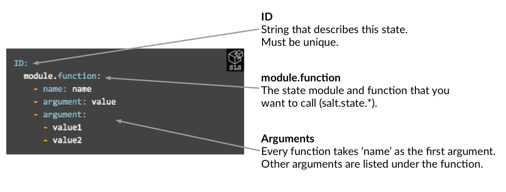
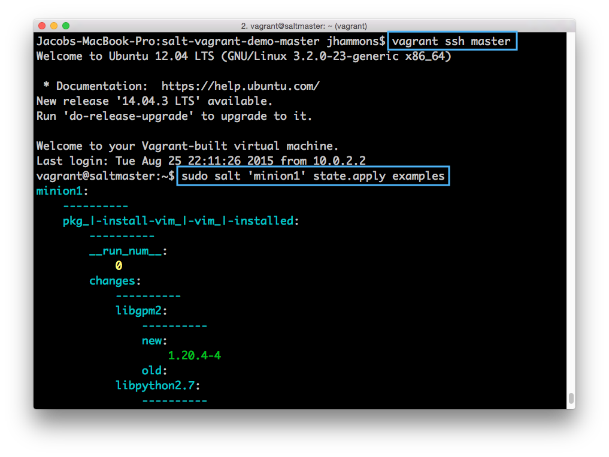
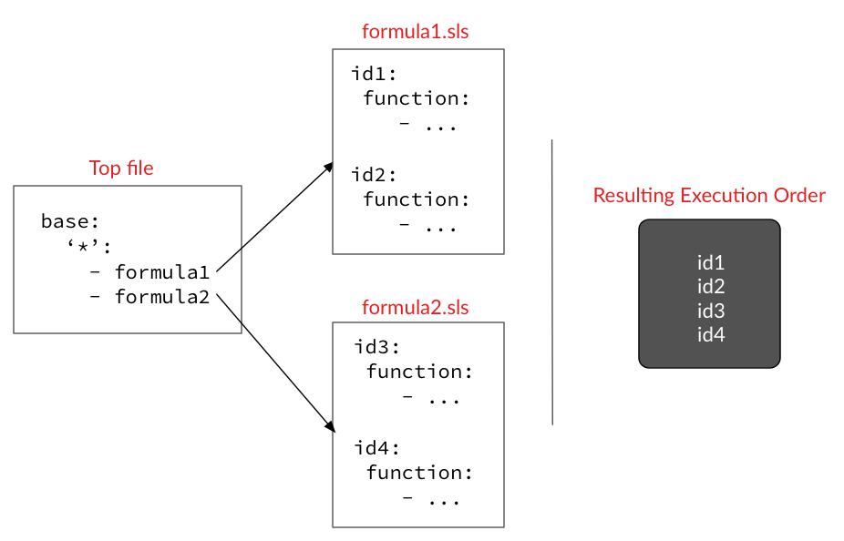
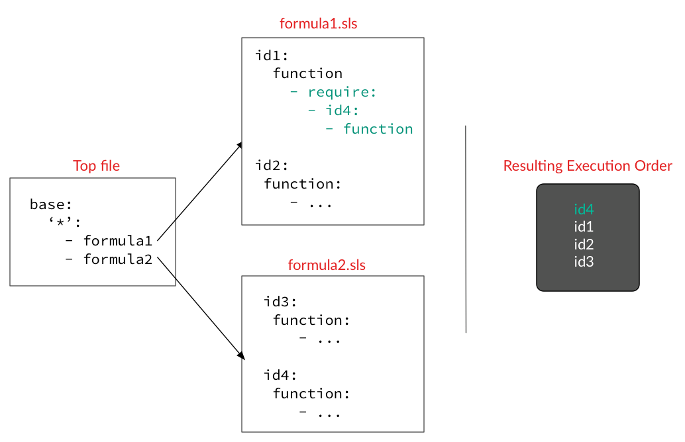

# 配置管理入门指南

## 简介

本入门指南将引导您了解SaltStack配置管理功能的要点。如果您完成了SaltStack Fundamentals，您已经知道：
- 如何写和保存一个简单的 salt state 
- 如何从命令行应用Salt state文件
- 如何使用状态Top文件来定位 salt state 

本指南基于这些概念，并解释了Salt状态函数调用，包括，必需条件和Jinja。

## 函数

您了解了SaltStack基础版中配置管理系统的基础知识，让我们深入了解Salt State功能。

### salt state 函数

salt state 函数是Salt states下的工作，在使用SaltStack的配置管理系统时，最重要的是掌握它。功能可用于安装和配置应用程序，创建用户，分发文件以及设置系统时可能需要执行的任何其他操作。

在我们调用任何函数之前，我们来看看Salt state的表示方式，Salt State函数调用的语法。

### 语法

使用YAML描述 states ，YAML是描述结构化数据的简单语言（类似于JSON，但更加人性化）。

下图显示了 salt state 声明的格式：



salt state 声明中的第一行是ID。身份证号码下方称为一个或多个salt state函数。
- 带有ID的行与每个函数调用的行都以以冒号（:)结尾。 - 每个函数调用都缩进了ID下面的两个空格。 - 将参数作为列表传递给每个函数。包含函数参数的每一行都以两个空格缩进开头，然后是一个连字符，然后再添加一个空格。

- 如果一个参数使用单个值，则名称和值位于与冒号和空格分开的同一行上。 - 如果参数列表，列表将从下一行开始，并缩进两个空格。

[函数文档](https://docs.saltstack.com/en/latest/salt-modindex.html#cap-s)是查找可用函数和参数的最佳资源（salt状态函数以salt.states *开头）。

### 功能示例

学习如何使用salt状态函数的最佳方法就是举例。要查看这些示例在行动中，让我们开始您在SaltStack基础知识中设置的演示环境。

打开一个终端到salt-vagrant-demo-master目录并运行vagrant。如果您需要复习或者不再有Vagrant环境，请参阅SaltStack Fundamentals的Demo Environment部分。

当您的环境出现时，创建一个名为`salt-vagrant-demo-master/saltstack/salt/examples.sls`的文件，您可以使用它来运行这些示例。

### 安装包装

将以下代码段复制到您创建的examples.sls文件中：
```
install vim:
  pkg.installed:
    - name: vim
```
当你的Vagrant环境（你回到命令提示符），ssh到你的salt master：
```
sudo salt 'minion1' state.apply examples
```



要获得额外的信息，请查看[state.pkg文档](https://docs.saltstack.com/en/latest/ref/states/all/salt.states.pkg.html)，看看是否可以找出调用哪个函数来确保这个包不在系统上（提示：函数以'rem'开头，以'oved'结尾） ）。
```
remove vim:
  pkg.removed:
    - name: vim
```

您可以按照类似的过程来测试本节中的其他示例。您可以每次替换examples.sls的内容，也可以为每个示例创建新的SLS文件。如果使用新文件，请确保更新state.apply调用以引用新名称。

```
sudo salt '*' state.apply name-of-your-sls-file-with-no-extension
```

### 创建目录

```yaml
create my_new_directory:
 file.directory:
   - name: /opt/my_new_directory
   - user: root
   - group: root
   - mode: 755
```

此示例仅使用几个可用的file.directory选项。看看[文档](https://docs.saltstack.com/en/latest/ref/states/all/salt.states.file.html#salt.states.file.directory)，再尝试添加一些。

### 服务运行

这种状态确保在salt minion上运行服务:
```yaml
Make sure the mysql service is running:
  service.running:
    - name: mysql
```
每个状态声明由状态ID标识。状态ID必须是唯一的，它们可以包含空格和数字。在前面的例子中，确保mysql服务正在运行是一个有效的ID。

您可以在单个状态ID下添加多个Salt状态函数调用：
```yaml
Install mysql and make sure the mysql service is running:
  pkg.installed:
    - name: mysql
  service.running:
    - name: mysql
```
### 在启动期间启动服务

调用函数时，请确保查看完整的参数列表，因为传递其他参数通常有很多功能可用。通过将enable：True传递给service.running，SaltStack将确保每次系统引导时启动服务。
```yaml
Make sure the mysql service is running and enable it to start at boot:
  service.running:
    - name: mysql
    - enable: True
```

### 下载GIT REPO

每个函数都有一个名称参数。如果您未定义名称的值，则Salt将使用状态ID作为name的值。在这个例子中，name参数是https://github.com/saltstack/salt.git：
```yaml
https://github.com/saltstack/salt-bootstrap:
  git.latest:
    - rev: develop
    - target: /tmp/salt
```
使用ID作为名称受到有经验的用户的欢迎，因为直接（keystrokes）。你也可以这样写这个状态：
```yaml
Clone the SaltStack bootstrap script repo:
  pkg.installed: 
    - name: git # make sure git is installed first!
  git.latest:
    - name: https://github.com/saltstack/salt-bootstrap
    - rev: develop
    - target: /tmp/salt
```
我们建议使用第二种格式，并始终定义name参数。ID应描述state正在做什么，即使它可能需要更多的文字。遵循这种格式往往使您的state更加一致，更容易重用，维护和调试。

### 添加用户

```yaml
user account for pete:
  user.present:
    - name: pete
    - shell: /bin/bash
    - home: /home/pete
    - groups:
      - sudo
```
groups参数是一个列表，所以它在下一行，缩进了两个空格，并且前面加了一个破折号。

### 添加到 hosts 

```yaml
myserver in hosts file:
  host.present:
    - name: myserver
    - ip: 192.168.0.42
```

平台规范化的一个很好的例子。即使master以不同的方式进行配置，这种state也可以应用于多个平台（Salt制定细节，因此您不用担心）。

### 执行一个可执行模块

在Salt state下可以调用service.restart和其他执行函数。

```yaml
restart vsftpd:
  module.run:
    - name: service.restart
    - m_name: vsftpd  # m_name gets passed to the execution module as "name"
```

执行功能（“远程执行功能”的缩写）是从salt命令行调用的命令，它们以 salt.module * 开头。

执行功能从 module.* 开始，因为它们是Salt的初始版本中可用的第一个也是唯一的模块，如果Salt被重写，我们应该可以用 execution.* 来代替它们。

#### 更进一步了解salt 执行和salt state功能

您可能会想知道为什么要使用服务执行功能而不是服务state函数，以及为什么Salt state和Salt执行函数之间似乎有很多重叠。

如果将salt执行函数（如service.restart）的名称与类似的salt state函数（如service.running）进行比较，则可能会注意到一个很小但重要的区别。salt state 函数仅用于应用配置所需的更改，否则不进行更改。salt 执行功能在每次调用时运行，这可能会导致系统更改，也可能不会导致系统更改。

当您调用service.running state函数时，该函数首先检查该服务是否已经在运行，并且只有在需要时启动它。当您调用service.restart执行功能时，始终重新启动该服务。

在许多情况下，Salt state 函数包含了Salt执行函数，并添加了附加代码来确定执行函数是否需要被调用。

#### test=True

应用salt state可能会导致目标系统发生许多变化。salt state 功能提供了一种机制来显示在实时运行过程中进行的更改。返回信息将显示将以黄色应用的states，结果报告为无。(The return information will show states that will be applied in yellow and the result is reported as None.)

```yaml
sudo salt 'minion1' state.apply examples test=True
```
#### init.sls

如果在state.apply或 state Top文件中定位目录，salt将在该目录中查找一个init.sls文件并将其应用。

### 这是（SORT OF）所有的都是它

您可以从这一点向前推进，并创建各种非常有用的salt state，只有salt state函数调用。salt ships具有数百种功能，可以管理各种应用程序和服务。

SaltStack的配置管理系统中的其他功能让您可以重复使用变量和循环、失败branch，并使用诸如'include'和'require'之类的语句来声明state 。

我们将在剩下的部分讨论这些功能。

## Pillar

Pillar 是使 salt states 重新使用的重要组成部分，所以我们更快速的编写salt state。

### salt pillar top file 

salt pillar 使用Top文件将Salt pillar 数据与Salt minions相匹配。这个Top文件非常像用于将Salt state与Salt minions相匹配的Top文件。

像salt state 的功能一样，salt pillar是最好的例子。创建`salt-vagrant-demo-master/saltstack/pillar`(译者注：同`/srv/pillar/`)目录，然后创建一个名为top.sls的新文件。添加以下内容：
```yaml
base:
  '*':
    - default
```

接下来，在同一个pillar目录中创建一个名为default.sls的文件，并添加以下内容:
```yaml
editor: vim
```
当Salt柱数据刷新时，每个Salt minion与top.sls文件中列出的目标相匹配。当Salt minion与目标相匹配时，它将接收在该目标下的列表中定义的所有Salt SLS文件。简单吧？

由于我们的* glob匹配所有Salt minions，所以每个Salt minion都会使用值为vim的 editor 的 pillar key 接收默认值。

### 刷新 salt pillar 

我们将使用我们刚配置的salt pillar 值，所以让我们首先刷新所有minion位置上的salt pillar数据：
```yaml
salt '*' saltutil.refresh_pillar
```

### pillar 在 state 中的应用

Salt pillar key 在Salt state 的字典中可用，因此您现在可以从上一节更新示例状态以使用此Salt pillar key：
```yaml
vim installed:
  pkg.installed:
    - name: {{ pillar['editor'] }}
```

salt pillar 数据是安全的，您可以使用它来保持Salt state的部分秘密。例如，您可以添加以下 key：value 对添加到Salt state：

```yaml
ftpusername: me
ftppassword: oxfm4@8t5gglu^h^&
```
然后在salt state下引用它们：
```yaml
sync directory using lftp:
  cmd.run:
    - name: lftp -c "open -u {{ pillar['ftpusername'] }},{{ pillar['ftppassword'] }}
           -p 22 sftp://example.com;mirror -c -R /local /remote"
```

### pillar 在命令行中应用

对于测试或临时管理，您可以直接在命令行上传递pillar值。这些值覆盖可能在Salt柱文件中设置的任何值。

```bash
salt '*' state.apply ftpsync pillar='{"ftpusername": "test", "ftppassword": "0ydyfww3giq8"}'
```

### salt pillar可以定位在salt state的任何一部分

希望，您可以使用salt pillar targeting 系统来定制Salt state文件中几乎任何值。

例如，您可以创建prodftp.sls和stageftp.sls salt pillar文件，将不同的凭据插入到每个文件中，然后针对每个文件定位不同的系统。

相同的examples.sls salt state 文件用于每个系统，但将根据收到的Salt pillar文件使用不同的用户名和密码。

## Include

为了使您的Salt状态模块化和可重用，每个配置任务在Salt state 树（D.R.Y）中只应描述一次。如果需要在多个地方使用相同的配置任务，可以在include中使用。

使用包含很简单。在您的 state 文件的顶部（任何ID之外），使用以下格式添加包含：
```yaml
include:
  - sls1 
  - sls2
```

其中sls1和sls2是要包括的SLS文件的名称。请注意，您不需要包含.sls扩展名。

如果要包含的Salt state 文件位于Salt state树的子目录中，请使用点（.）作为目录分隔符：
```yaml
include:
  - dir.sls1 
```

包括的salt state插入当前文件的顶部，并先处理。

### 实例

还记的本指南前面的 salt state 吗？
```yaml
sync directory using lftp:
  cmd.run:
    - name: lftp -c "open -u {{ pillar['ftpusername'] }},{{ pillar['ftppassword'] }}
           -p 22 sftp://example.com;mirror -c -R /local /remote"
```
这个salt state 取决于lftp可执行文件，所以创建另一个Salt state可能是一个好主意，以确保安装了lftp。然后，我们可以使用include来组合两个状态。

`srv/salt/lftp.sls:`
```yaml
install lftp:
  pkg.installed:
    - name: lftp
```

`srv/salt/dir-sync.sls:`
```yaml
include:
  - lftp

sync directory using lftp:
  cmd.run:
    - name: lftp -c "open -u {{ pillar['ftpusername'] }},{{ pillar['ftppassword'] }}
           -p 22 sftp://example.com;mirror -c -R /local /remote"
```

使用include的优点是可以在其他地方使用lftp.sls Salt state来安装lftp而不同步这些目录。

### 为什么不包括使用顶级文件？

代替一个salt state包括另一个：
```yaml
include:
  - sls1

install a useful package:
  pkg.installed:
    - name: cowsay
```
您可以选择将每个文件放在自己的Salt state 文件中，然后使用顶层文件同时包含：
```yaml
base:
  'web*':
    - sls1
    - sls2
```

如果 salt state 总是需要其他state，那么使用包含是更好的选择。如果只有一些系统应该同时收到salt state，包括Top文件中的两个state，都可以灵活地选择哪些系统接收。

## 执行顺序和依赖条件

### 执行顺序

配置管理中最重要（和复杂的）方面之一是确保每个任务在正确的时间执行。

默认情况下，Salt state 文件中的每个ID都按文件中显示的顺序执行。另外，在Top文件中，每个Salt state 文件按照列出的顺序应用。例如，下图中的 state ID作为组织Top文件和Salt state 文件的顺序运行顺序：



通过组织要按此顺序应用的Salt state，您可以控制执行顺序而不显式定义依赖关系。

### 依赖 

必需条件允许您明确指定state中的ID的依赖关系。如果添加一个表示id1需要id4的语句，则首先应用id4。



您可以使用state.show_sls执行功能查看应用Salt state 的顺序。例如：
```yaml
salt 'minion1' state.show_sls sls1[,sls2,...] 
```

要从之前创建的examples.sls文件中查看应用Salt state 的顺序：
```
salt 'minion1' state.show_sls examples
```

### 更高级的依赖管理

您可以使用其他几个语句来控制执行顺序。您可以在[请求和其他全局状态参数](https://docs.saltstack.com/en/latest/ref/states/requisites.html)中找到详细信息。


## JINJA

Salt 包括可用于Salt state 文件，Salt pillar 文件和Salt管理的其他文件。

Salt让您可以使用Jinja访问minion配置值，grain和pillar数据，并调用Salt执行模块。这是在Jinja已经可用的标准控件结构和Python数据类型的附加。

### 条件

Jinja最常见的用途之一是将条件语句插入Salt pillar文件。因为许多发行版具有不同的包名称，您可以使用os grain来设置平台特定的路径，包名称和其他值。

例如：
```yaml

apache: httpd
git: git

apache: apache2
git: git-core

```

正如你所看到的，salt grains可以在一个字典中，就像salt pillar一样。此示例检查salt grains值以设置操作系统特定的salt pillar key。

将上面的代码片段保存到`saltstack/columns/common.sls`文件中，然后运行以下命令进行刷新，然后列出每个子节点的Salt pillar值：
```yaml
salt '*' saltutil.refresh_pillar
salt '*' pillar.items
```

您的minion应列出为Debian OS系列设置的值。

设置这些值后，应用以下Salt state时：
```yaml
install apache:
  pkg.installed:
    - name: {{ pillar['apache'] }}
```

httpd软件包安装在RedHat上，而apache2软件包安装在Debian上。

### 循环

循环在Salt state下创建用户和文件夹很有用。

```yaml

{{ usr }}:
  user.present

```

```yaml

{{ DIR }}:
  file.directory:
    - user: root
    - group: root
    - mode: 774

```
一般来说，你应该尽量保持salt state 尽可能的简单。如果您发现自己编写复杂的Jinja，您应该考虑将任务分解成多个Salt state，或者为任务编写一个自定义Salt执行模块（这比它听起来更容易，特别是如果你知道一些Python！）。

### 使用salt获取数据

您可以从Jinja调用Salt执行功能，从系统获取实时数据。

```yaml
{{ salt.cmd.run('whoami') }}
```

## 文件管理

在系统上获取正确的文件往往比安装正确的软件更具挑战性。 Salt具有内置的文件服务器，可以将文件和文件夹传送到受管系统。

### SALT://

您熟悉将 salt state文件放在`srv/salt`目录中，但是您可能不知道的是，您放置在此目录中的任何其他文件和文件夹也可供您的Salt minions使用。您可以使用`salt：// `URL引用这些文件，后跟文件相对于`srv/salt`目录的路径。

### file.managed

这个salt state功能允许您通过在Salt master上指定源文件来管理本地文件。

```yaml
deploy the http.conf file:
  file.managed:
    - name: /etc/http/conf/http.conf
    - source: salt://apache/http.conf
```

由于源路径以`salt：//`开头，因此我们可以确定该文件的源是Salt master上的`/srv/salt/apache/http.conf`。

每次应用此Salt state 时，Salt都会确保本地文件与服务器上的版本匹配。这有助于防止配置漂移，并有助于确保应用程序在不同的系统上配置相同。

例如，如果要分发lftp的全局配置文件，其中包含限制下载速率的自定义设置，我们可以使用file.managed：
```yaml
install network packages:
  pkg.installed:
    - pkgs:
      - rsync
      - lftp
      - curl

copy lftp config file:
  file.managed:
    - name: /etc/lftp.conf
    - source: salt://_tmpl_lftp.conf
```

另一个选择，因为我们的配置更改是单行，是使用file.append来简单地插入我们要添加的新行：

```yaml
install network packages:
  pkg.installed:
    - pkgs:
      - rsync
      - lftp
      - curl

update lftp conf:
  file.append:
    - name: /etc/lftp.conf
    - text: set net:limit-rate 100000:500000
```

### file.recurse 

此Salt State功能将复制整个目录。

```yaml
copy some files to the web server:
  file.recurse:
    - name: /var/www
    - source: salt://apache/www
```

### 总结

您现在应该更好地了解SaltStack的配置管理系统，具有足够的知识来开始编写自己的salt state。如果您正在寻找灵感，[SaltStack Formula Repo](https://github.com/saltstack-formulas)包含许多示例。