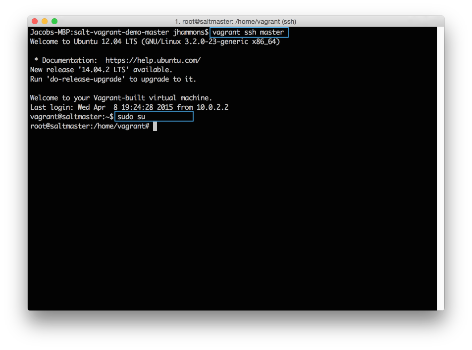
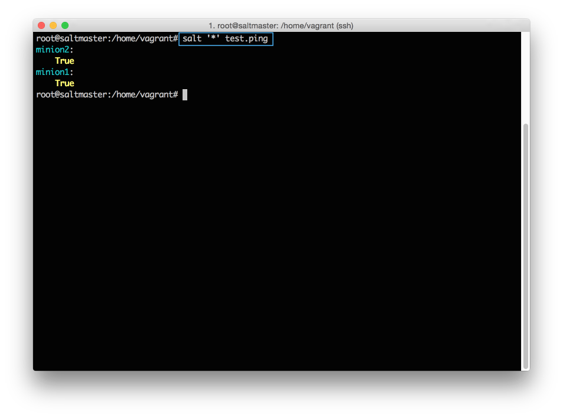
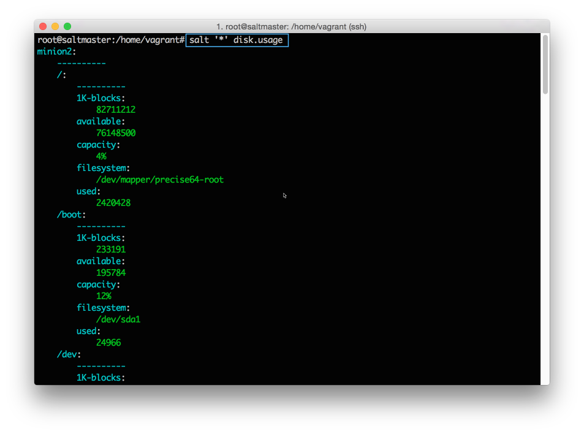
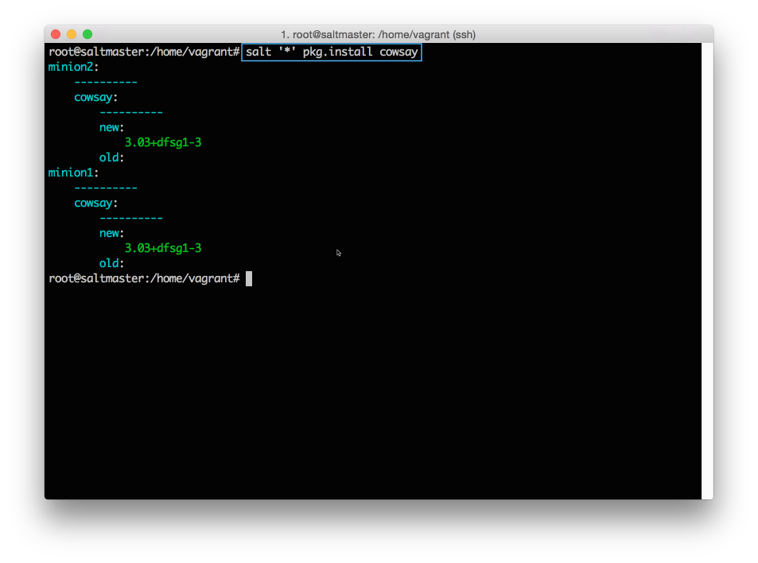
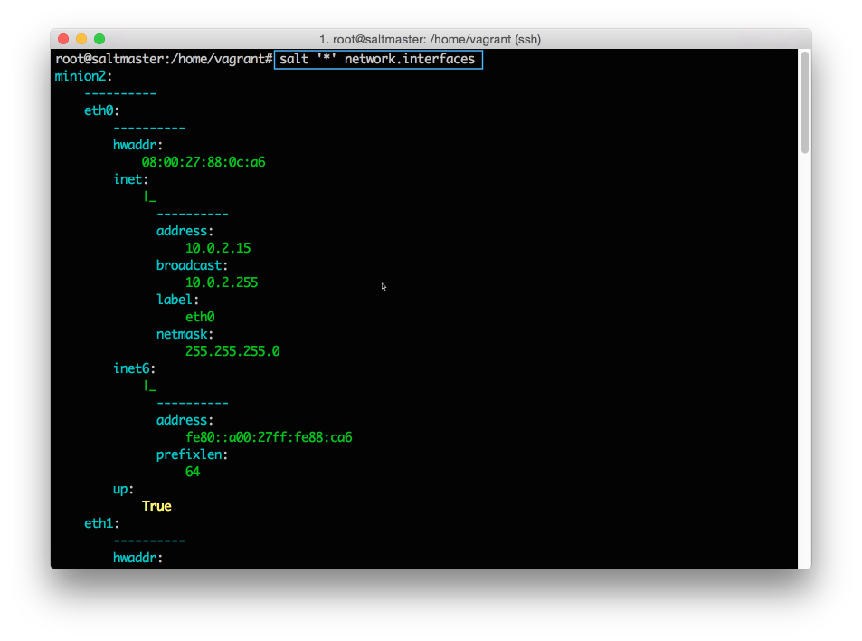
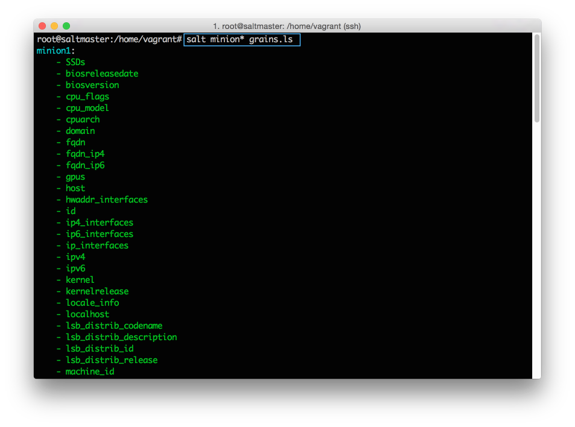

# SaltStack 的基础

本入门指南将引导您了解开始使用SaltStack时需要学习的基本概念。

我们将解释如何：
- 安装SaltStack 
- 在受管系统上运行命令 
- 定义可重复使用的配置 
- 将命令和配置应用于特定系统

学习SaltStack是一个实践经验。通过阅读本指南，您可以轻松获得这些内容，SaltStack易于设置，我们已经包含了几个可以运行的示例来帮助您学习。此外，您可以在完成后继续保持演示环境，继续尝试。

## 实例测试环境

完成这些说明以建立一个简单的SaltStack环境。

1. 安装[VirtuanBox](https://www.virtualbox.org/)。
2. 安装[Vagrant](https://www.vagrantup.com/)。
3. 下载[https://github.com/UtahDave/salt-vagrant-demo](https://github.com/UtahDave/salt-vagrant-demo)。
您可以直接从GitHub使用git或下载项目的zip：


4. 提取您下载的zip文件，然后打开一个命令提示符到提取的目录:
```bash
# windows 
cd %homepath%\Downloads\salt-vagrant-demo-master

# mac 
cd ~\Downloads\salt-vagrant-demo-master
```

5. 运行`vagrant`，启动演示环境:

```
vagrant up 
```
在`vagrant up `（〜10分钟）之后，您将返回命令提示符，您随时可以继续执行本指南。

## 安装SaltStack

原文：[https://docs.saltstack.com/en/getstarted/fundamentals/install.html](https://docs.saltstack.com/en/getstarted/fundamentals/install.html)

要安装SaltStack，您将需要一个详细的网络图，其中包含完整的DNS映射，企业数据库服务器，除此之外，您不需要任何东西。所有您需要的是一种在系统上安装软件包的方法，大约10分钟。

您可以从包管理器，pip，直接源码或使用引导脚本安装SaltStack。SaltStack还提供专用工具来创建机器，并在公共和私有云（salt-cloud and salt-virt）上安装。我们不会在这里介绍这些工具，但只要知道，一旦您有一个正在管理的系统，SaltStack在物理，云和虚拟资源之间使用是相同的。

### 安装

如果您使用上一节中链接的Vagrant项目，则已经安装了SaltStack，并且已经接受了每个服务的连接。您可以在下面的接受连接中完成任务，以验证您的`minion`是否已连接。

如果您使用的是不同的环境，则安装SaltStack最简单的方法是使用引导脚本。此脚本在大多数操作系统上安装SaltStack与几个常用salt命令。具体安装步骤,
- [视频](https://docs.saltstack.com/en/getstarted/fundamentals/install.html)
- [文档](https://docs.saltstack.com/en/latest/topics/installation/index.html#quick-install)

### 接受链接

Salt Master和Salt minion之间的每个连接都使用加密密钥进行管理和保护。安装完成后，每个Salt minion将其公钥发送给Salt master，并迫切地等待接受。在系统可以从Salt master接收到命令之前，必须接受Salt minion 的公钥。

在命令提示符下，进入vagrant-demo-master目录，并运行以下命令登录到您的Salt master:
```
vagrant ssh master 
```

连接后，运行以下命令切换到root用户：
```
sudo su
```



#### 查看所有的键

在Salt master上，您可以快速查看所有Salt minion连接，并查看连接是否被接受，拒绝或挂起。

```
salt-key --list-all
```

#### 接受一个特定的钥匙

在Salt minion可连接之前，您必须接受其钥匙。

```
salt-key --accept=<key>
```

#### 接受所有KEYS


### 执行一条命令

在您接受每个密钥后，从Salt master发送一个命令，以验证您的Salt Minions是否正在侦听：
```
salt '*' test.ping
```



如果您没有看到所有的Salt minion回应，那么您需要手动排查到底发生了什么。你可能键入了一个错误的或不接受的一些keys，或者忘记在某个地方添加一个空格（#soml）。在你的Salt minion全部回应之后，继续下一节，让SaltStack工作。

## 命令执行

安装SaltStack之后，您便可以运行shell命令，更新软件包和分发文件到所有受管系统。作为一个奖励，所有的响应都是以一致的，可配置的格式返回的，所以你可以很容易地看到什么是没有工作。

### 命令语法

Salt 命令使用通用结构执行：


**target：** 确定哪个系统应用命令。默认情况下使用主机名称globbing，但还有其他许多方法可以选择和过滤，以后我们会进一步讲解。现在，已经足够知道*针对所有受管系统。
**command (module.function)：** 这就是您如何利用Salt的实力。命令由模块和功能组成，Salt配有内置模块，用于安装软件，复制文件，检查服务以及要自动化的大多数其他任务。
**arguments：** 提供您正在调用的功能所需的任何额外数据。例如，pkg.install函数需要知道要安装的软件包。你可以用一个参数来告诉它。

### 查看命令文档

您可以将模块或函数名称传递给sys.doc执行模块，以从命令行直接获取任何模块的详细信息。此列表将根据目标进行过滤。

```
salt '*' sys.doc
salt '*' sys.doc pkg
salt '*' sys.doc pkg.install
```

### 运行 shell 命令

Salt允许您使用`cmd.run`跨多个系统执行shell命令：
```
salt '*' cmd.run 'ls -l /etc'
```

所有受管系统同时并立即执行此命令，然后将输出返回给Salt主机。


### 运行功能函数 

虽然可以使用cmd.run来执行shell命令，但当您添加Salt执行功能时，才体现出其功能的强大。Saltstack 社区为创造数百个简化大多数管理任务的函数付出了巨大的努力。更好的是，所有支持的平台可以一致地使用相同的函数。抵制住使用shell的冲动，学习使用salt function吧。

### 显示磁盘的使用情况

```
salt '*' disk.usage 
```




### 安装软件包

```
salt '*' pkg.install cowsay
```



### 列出网络接口

```
salt '*' network.interfaces
```



这些只是可用的许多执行功能的几个例子。

## TARGETING

Target 是在运行命令，应用配置以及在SaltStack中进行几乎任何涉及Salt minion的任何其他操作时，用来选择Salt minions的。

Target 最简单的方法是使用Salt minion ID。该值可以设置为在minion配置文件中所需的任何内容，并且可以使用引导脚本中的-i选项指定。

```
salt 'minion1' disk.usage
```

### GLOBBING

通过简单地在目标中包含通配符来支持Salt minion的GLOBBING：
```
salt 'minion*' disk.usage
```

### 其他方式

在理想的世界中，您环境中的每个系统都有一个结构化的名称，可以告诉您需要了解有关硬件，操作系统和系统角色的一切。在等待这个世界的同时，SaltStack提供了强大的定位系统，帮助您根据静态和自定义数据查找和过滤系统。

Target 可以基于使用grains系统的Salt minion系统信息：
```
salt -G 'os:Ubuntu' test.ping
```

可以通过正则表达式过滤目标:
```
salt -E 'minion[0-9]' test.ping
```

可以在列表中明确指定：
```
salt -L 'minion1,minion2' test.ping
```

或者可以在一个命令中组合多个目标类型：
```
salt -C 'G@os:Ubuntu and minion* or S@192.168.50.*' test.ping
```

不要太担心这些定位方法了。只要确定目标机制就足够灵活，找到要管理的系统。

### Grains 

Grains 是静态信息,SaltStack收集关于底层管理系统的信息。 SaltStack为操作系统，域名，IP地址，内核，操作系统类型，内存和许多其他系统属性收集grains。

您可以将其自己的grains添加到Salt minion，将它们放在Salt master上的`/etc/salt/grains`文件中，或者在grain部分的Salt minion配置文件中。例如，许多用户向每个Salt minion添加称为Role的自定义grains来描述系统的功能。

您可以使用grains.ls命令列出Salt minion上的所有grains：



## 

